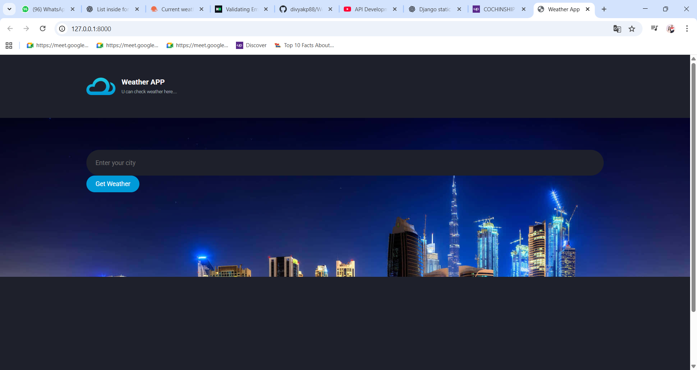
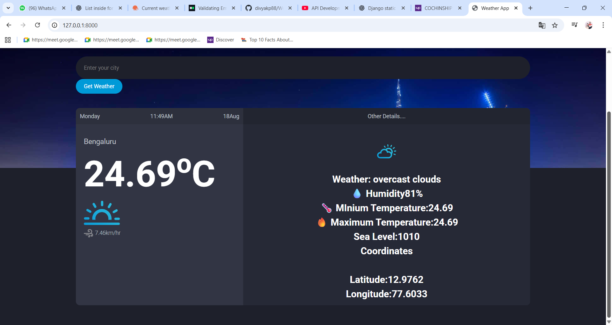

# Weather_App
A web-based weather application built with Django and Django REST Framework that fetches real-time weather data from OpenWeatherAPI

## 📸 Screenshots

### 🌤️ Weather App - Main View


### 🔍 Weather Details View



## Features

- 🔍 Get live weather data by entering city name
- 📅 Displays current day, date, and time
- 🌡️ Temperature, humidity, max/min temp, and sea level
- 🌬️ Wind speed
- 📍 Coordinates (Latitude & Longitude)
- 🌈 Beautiful UI with background image
- 🧠 Error handling for invalid cities

----

## Technologies Used

-**Backend**: Django,Python

-**Frontend**-HTML,CSS

-**API**-OpenWeatherMap/Custom Django REST API

-**Others**-Django Template,static file management


---

## 🔧 How It Works

1. User enters a city name.
2. The app sends a request to the Django REST API.
3. Third-Party API Call:
   The Django REST API makes a request to the OpenWeatherMap API using the city name to fetch live weather data.
4. Weather data is fetched and displayed with location-specific information.

---

## 💻 Setup Instructions

1. **Clone the repository:**

```bash
git clone https://github.com/divyakp88/Weather_App.git
cd weather_app
```
2. **Create a virtual environment & activate it:**

```bash

python -m venv env
source env/bin/activate    # On Windows: env\Scripts\activate
```
3.**Install dependencies:**

```bash

pip install -r requirements.txt
```
4.**Run the server:**

```bash

python manage.py runserver
```
5.**Visit in browser:**

http://127.0.0.1:8000/


